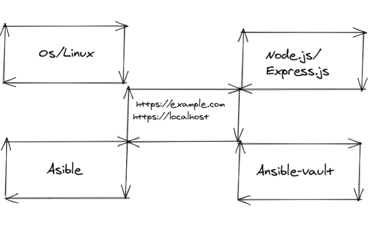

# Devops Workflows

 

WebUI with nodejs and express

#### Requirements.
##### To insatall Nodejs and Ansible
#### 1. Clone the soure repository. 
```bash
git clone git@gitea.micrometre.uk:infrastructure/devops.git
Make insatall_nodejs
Make insatall_ansible
```

Getinging started with ansible inital setup with ansible vault


```
Requires to edit
user: debo
password: _p0o9i8u7y #pass word to open .valt_pass file
```

```bash
#To Edit the sudo password using ansibl vault
ansible-vault edit password.yml
#Vault refrers to the .valt_pass file for auth.
```

access using
http://localhost:3000

Todos
[]user input for user name and password

source
https://dev-in-test.co.uk/
